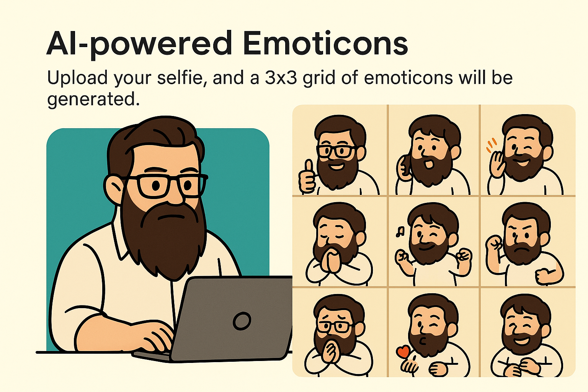
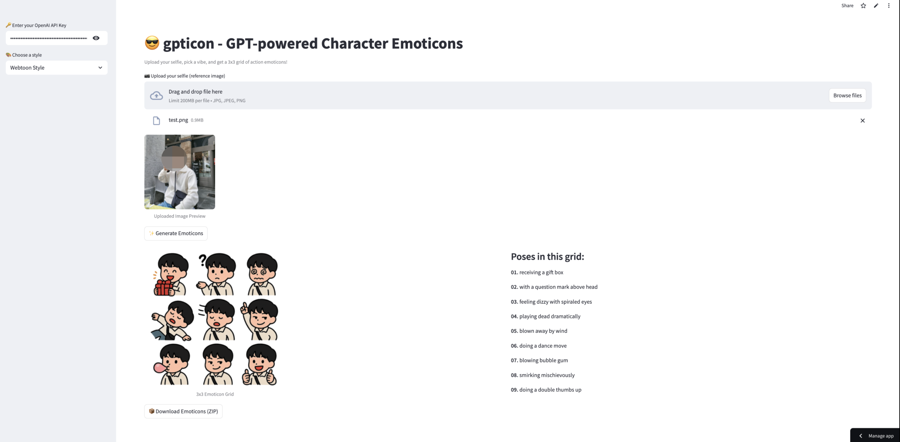

# 😎 gpticon - GPT-powered Character Emoticons



**Turn your selfie into a 3x3 grid of action-packed emoticons – instantly. Just add your OpenAI API key.**

👉 [Try it live on Streamlit](https://sooftware-gpticon-app-4twl6r.streamlit.app/)  
_(No signup. No installs. Just upload and smile.)_

---

<div align="center">
  
  <br/>
  (Used my friend’s photo for this test... didn’t ask for permission 😅)</sub>
</div>

---

## ✨ What is gpticon?

`gpticon` (pronounced *ji-pee-tee-con*) is a quirky, powerful tool that uses your selfie and transforms it into **nine unique character emoticons**, rendered in your chosen style.

- 🎭 **Emoticon Grid**: 3x3 layout generated from 150+ pre-written pose prompts
- 🎨 **Multiple Styles**: Choose from Pixar, Webtoon, Anime, Watercolor, and more
- ⚙️ **Fully Customizable**: Add your own prompts, poses, or styles in `settings.py`
- 🤖 **Powered by GPT-4 Vision**: Leverages OpenAI's API for image generation

---

## 🖼️ Example Output

Here’s what a typical 3x3 grid looks like:

> Poses in this grid:
> 
> 01. Smiling brightly  
> 02. Crying with big tears  
> 03. Doing a silly dance  
> 04. Hiding under a table  
> 05. Posing like a K-pop idol  
> 06. Sneezing  
> 07. Looking proud with arms crossed  
> 08. Blowing bubble gum  
> 09. Snoring loudly  

---

## ⚙️ How It Works

1. Upload your selfie (PNG or JPG)
2. Choose a style from the dropdown
3. Hit **Generate Emoticons**
4. gpticon randomly selects 9 poses and draws

---

## 🤔 Why a 3x3 Grid?

There are **three key reasons** why gpticon creates a 3x3 grid instead of generating individual emoticons:

1. **Efficiency** – Creating one image with all 9 emoticons **saves API calls**, time, and money.  
2. **Consistency** – Generating them together in a single image ensures the **art style and character design remain coherent** across all poses.
3. **Prompt Robustness** – From our testing, larger formats like 4x4 often result in layout issues, broken compositions, or hallucinated poses. A 3x3 grid strikes the right balance between variety and reliability.

> 💡 We use a simple grid-splitting algorithm to crop the 9 images. If you're a wizard with image slicing, we’d love your PR!

---

## 🚀 Quickstart

```bash
git clone https://github.com/sooftware/gpticon.git
cd gpticon
pip install -r requirements.txt
streamlit run app.py

```

You’ll need your own OpenAI API Key to use it.

## 🛠️ Customization Guide

Want to make it yours?

- Add or edit pose prompts → settings.py
- Define your own styles and art directions
- Tweak the image generation prompts
- Modify grid sizes or pose rules (if you're feeling spicy)

## 💡 Features

- 🎲 Randomly picks 9 poses from a curated set of 150+ 
- 🎨 Supports 10+ stylized visual modes
- ✂️ Automatically slices and zips your emoticons for download
- 🛠️ Hackable and developer-friendly

## 🤝 Contribute

We welcome contributions! If you have ideas, bug fixes, or new features, please open an issue or submit a pull request.

- 🪄 Improve the grid-slicing algorithm
- 🎭 Add new pose ideas or styles
- 🧪 Help test with other model endpoints (DALL·E, SDXL, etc.)

Pull requests and ideas are always welcome — this project is meant to evolve with the community.

## ⭐ Star This Project!

If you smiled while using it, or if your GPT-self did something funny —
drop us a ⭐ on GitHub and share it with friends. Let’s make the internet more expressive together.

## 👤 Author
Made with 💛 by [@sooftware](https://github.com/sooftware)  
Have an idea? Open an issue, drop a star, or tag us in your creations!
